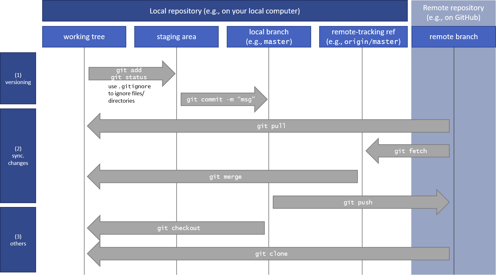

# Versioning Using GitHub

1. Configure

   In order to use Github locally, you can configure your user name and email of your Github account in local PC. In your terminal, you can type the following command to configure.

   ```bash
   # set the author name for your commits
   git config --global user.name "[name]"

   # set the author email for your commits
   git config --global user.email "[email address]"

   # enables colorization for command line output
   git config --global color.ui auto
   ```

2. Create repositories

   To start, you need to create a new repository once. You can create a local repository and then push to Github, or clone an existing repository from Github to your local PC.

   ```bash
   # create a git repository from a locally existing directory
   git init

   # clone an existing repository from Github to local PC
   git clone "[url]"
   ```

3. Branches

   Branches are key tools for version control. Everyone can make changes to his own working branch, and merge their changes to a master branch. You can use `git status` to check your working branch.

   ``` bash
   # create a branch [branch-name]
   git branch [branch-name]

   # switch to s specific branch [branch-name]
   git checkout [branch-name]

   # merge a specific branch [branch] to the working branch
   git merge [branch]

   # delete a specific branch [branch-name]
   git branch -d [branch-name]
   ```

4. Make changes

   Everytime when you make changes to your project, you can use the following command to browse and inspect changes.

   ``` bash
   # list all version histories of current branch
   git log

   # present content differences between two branches [first-branch] vs [second-branch]
   git diff [first-branch]...[second-branch]

   # snapshot the file in preparation for versioning
   git add [file]

   # record file snapshots permanently in version history
   git commit -m "[descriptive message]"
   ```

5. Sync

   Everyone can sync their local changes with the remote repository on Github(usually the online master branch). You can also get changes to your local repository from the remote repository.

   ``` bash
   # download all history from the remote tracking branches
   git fetch

   # combine remote tracking branch into current local branch
   git merge

   # upload all local branch commits to GitHub
   git push

   # update your local working branch with all new commits from the remote branch on GitHub
   # `git pull` is a combination of `git fetch` and `git merge`
   git pull
   ```

   

6. Reset

   You may want to reset your changes and replace them with historical version.

   ``` bash
   # undo all commits after [commit], preserving changes locally
   git reset [commit]

   # drop all history and changes back to the specified commit
   git reset --hard [commit]
   ```

## Horizontal rules

Aenean in finibus diam. Duis mollis est eget nibh volutpat, fermentum aliquet
dui mollis. Nam vulputate tincidunt fringilla. Nullam dignissim ultrices urna
non auctor.

***

Integer vehicula feugiat magna, a mollis tellus. Nam mollis ex ante, quis
elementum eros tempor rutrum. Aenean efficitur lobortis lacinia. Nulla
consectetur feugiat sodales.

## Data tables

| Sollicitudo / Pellentesi | consectetur | adipiscing | elit    | arcu | sed |
| ------------------------ | ----------- | ---------- | ------- | ---- | --- |
| Vivamus a pharetra       | yes         | yes        | yes     | yes  | yes |
| Ornare viverra ex        | yes         | yes        | yes     | yes  | yes |
| Mauris a ullamcorper     | yes         | yes        | partial | yes  | yes |
| Nullam urna elit         | yes         | yes        | yes     | yes  | yes |
| Malesuada eget finibus   | yes         | yes        | yes     | yes  | yes |
| Ullamcorper              | yes         | yes        | yes     | yes  | yes |
| Vestibulum sodales       | yes         | -          | yes     | -    | yes |
| Pulvinar nisl            | yes         | yes        | yes     | -    | -   |
| Pharetra aliquet est     | yes         | yes        | yes     | yes  | yes |
| Sed suscipit             | yes         | yes        | yes     | yes  | yes |
| Orci non pretium         | yes         | partial    | -       | -    | -   |

Sed sagittis eleifend rutrum. Donec vitae suscipit est. Nullam tempus tellus
non sem sollicitudin, quis rutrum leo facilisis. Nulla tempor lobortis orci,
at elementum urna sodales vitae. In in vehicula nulla, quis ornare libero.

| Left       | Center   | Right   |
| :--------- | :------: | ------: |
| Lorem      | *dolor*  | `amet`  |
| [ipsum](#) | **sit**  |         |

Vestibulum vitae orci quis ante viverra ultricies ut eget turpis. Sed eu
lectus dapibus, eleifend nulla varius, lobortis turpis. In ac hendrerit nisl,
sit amet laoreet nibh.

<table>
  <colgroup>
    <col width="30%">
    <col width="70%">
  </colgroup>
  <thead>
    <tr class="header">
      <th>Table</th>
      <th>with colgroups (Pandoc)</th>
    </tr>
  </thead>
  <tbody>
    <tr>
      <td>Lorem</td>
      <td>ipsum dolor sit amet.</td>
    </tr>
    <tr>
      <td>Sed sagittis</td>
      <td>eleifend rutrum. Donec vitae suscipit est.</td>
    </tr>
  </tbody>
</table>
